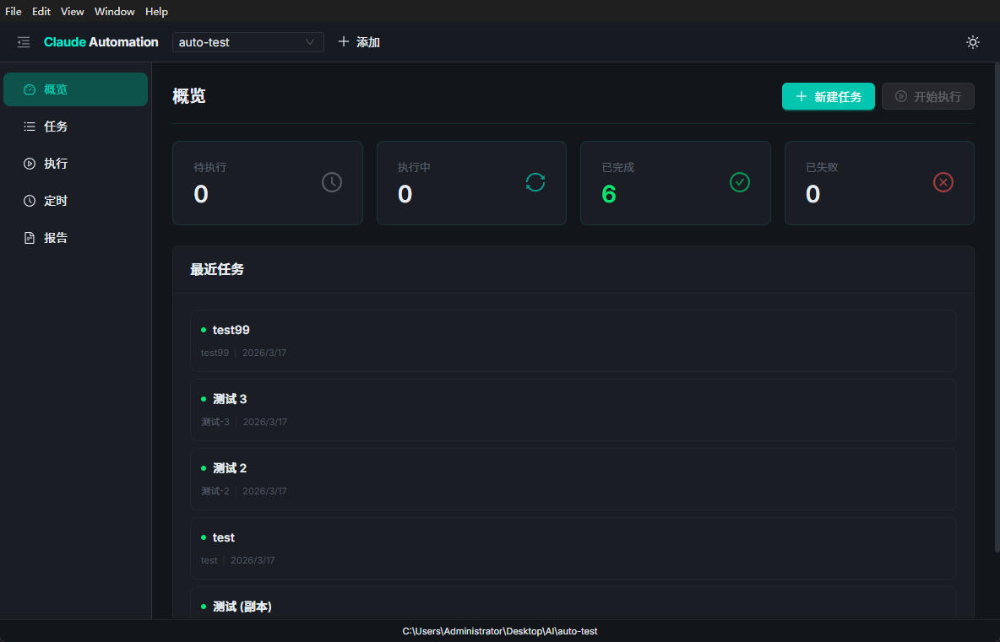

# Claude Automation

> 基于 Electron + React 的桌面应用，通过可视化界面管理 Claude Code CLI 自动化任务。



## 简介

Claude Automation 让开发者可以批量编写代码修改任务，交由 Claude Code 在后台自动执行，并在独立 Git 分支上生成变更。开发者只需在次日审查合并即可——**写任务、自动执行、人工审查**。

## 功能特性

- **任务管理** — 看板式任务面板，支持创建、编辑、拖拽管理任务生命周期
- **自动执行** — 调用 Claude Code headless 模式，逐任务在独立分支上执行
- **实时日志** — 执行过程中实时流式展示 Claude 输出日志
- **执行报告** — 自动生成任务执行摘要，包含成功/失败统计与 Git diff
- **定时调度** — 支持 cron 定时执行，夜间自动跑任务、早晨生成报告
- **多项目支持** — 可切换管理多个代码仓库的自动化任务
- **安全隔离** — 每个任务在独立 Git 分支执行，失败自动回滚，不影响主分支
- **深色/浅色主题** — 默认深色主题，支持一键切换

## 技术栈

| 类别 | 技术 |
|------|------|
| 框架 | Electron 33 + React 18 |
| 语言 | TypeScript |
| 构建 | electron-vite |
| UI | Ant Design 5 |
| 状态管理 | Zustand 5 |
| 路由 | React Router 6 |
| AI 引擎 | Claude Code CLI (headless) |

## 环境要求

- **Node.js** 18+
- **Git** 2.x
- **Claude Code CLI** （已安装并登录）

## 快速开始

```bash
# 克隆仓库
git clone <repo-url>
cd ai-automation

# 安装依赖
npm install

# 启动开发环境
npm run dev
```

## 常用命令

```bash
npm run dev              # 启动开发服务（热重载）
npm run build            # 生产构建
npm run preview          # 预览生产构建
npm run build:win        # 打包 Windows 安装程序 (NSIS)
npm run build:mac        # 打包 macOS 应用 (DMG)
npm run build:all        # 同时打包 Windows 和 macOS
npm run typecheck        # TypeScript 类型检查
npm run typecheck:web    # 仅检查渲染进程
npm run typecheck:node   # 仅检查主进程/预加载脚本
```

## 项目结构

```
src/
├── main.tsx                 # React 入口
├── App.tsx                  # 根组件（路由配置）
├── pages/                   # 页面组件
│   ├── Dashboard.tsx        #   概览仪表板
│   ├── Tasks.tsx            #   任务看板
│   ├── TaskEditor.tsx       #   任务编辑器
│   ├── Execution.tsx        #   执行监控
│   └── Reports.tsx          #   执行报告
├── stores/                  # Zustand 状态管理
│   ├── project-store.ts     #   项目管理
│   ├── task-store.ts        #   任务 CRUD
│   └── runner-store.ts      #   执行状态与日志流
└── ai/                      # 设计系统
    ├── theme/               #   主题（深色/浅色）
    ├── components/          #   通用组件
    ├── layouts/             #   布局组件
    └── patterns/            #   业务模式组件

electron/
├── main/index.ts            # Electron 主进程
├── preload/index.ts         # 预加载脚本（IPC API）
└── core/                    # 核心逻辑（runner、task-manager、config）
```

## 工作流程

```
编写任务 → 加入队列 → Claude 自动执行 → 独立分支提交 → 人工审查合并
```

1. **编写任务** — 在 UI 中创建任务，描述需要的代码修改
2. **执行任务** — 点击执行或定时触发，Claude Code 逐任务处理
3. **分支隔离** — 每个任务在 `ai/<task-name>` 分支上执行，互不干扰
4. **审查合并** — 执行完成后人工 review，确认无误后合并到主分支

## 安全机制

- Git 分支隔离，不直接修改主分支
- 执行失败自动回滚（`git checkout . && git clean`）
- 单任务限制：最多 10 轮对话、10 分钟超时、$5 预算上限
- 工具白名单：仅允许 Read、Edit、Write、Glob、Grep 等安全操作
- 不自动推送，所有变更仅在本地分支

## 文档

- [使用手册 (USAGE.md)](USAGE.md) — 详细操作指南与示例
- [技术方案 (TECHNICAL.md)](TECHNICAL.md) — 架构设计与实现细节

## 许可证

MIT
